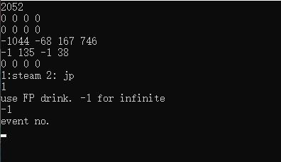
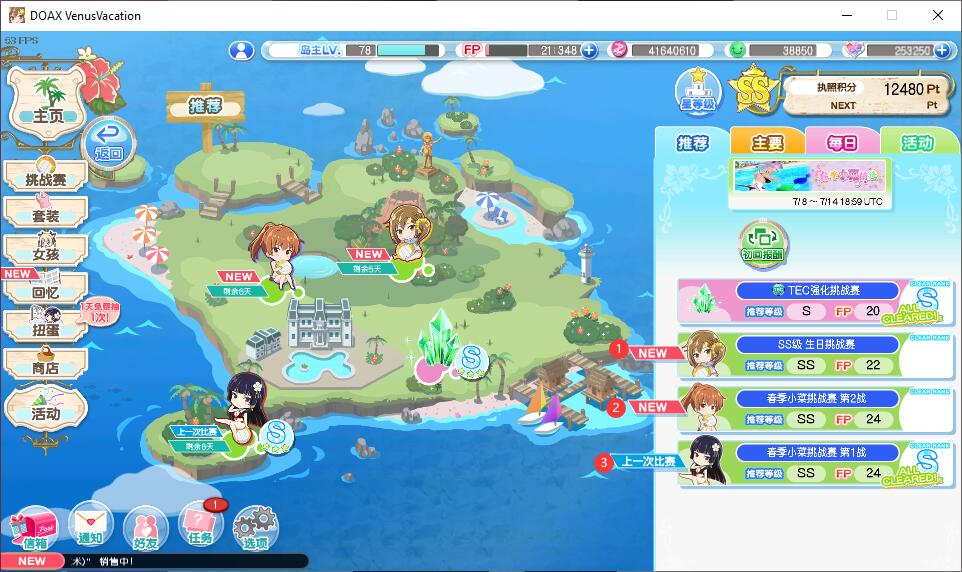

# DOAXVV-script

A program automatically plays DOAXVV events. It plays slowly to avoid captchas. But it can deal with captchas.

It can only play normal events for now.

## Dependencies

- OpenCV
- (Optional) Baidu OCR API: Used to recognize captcha.

## How to use

Run the game with 960 x 540 resolution (and Chinese language for steam version). Move the window to somewhere you like, and don't move it again after starting the program.

Click into "Festivals" in the game. Run the program.

Choose platform: steam or DMM. Choose using how many FP drinks until stop. Choose the event position according to the figure below.

The program will then start to play the events automatically. The default speed should not trigger the captcha.

### Optional: Deal with captcha

If the program triggers the captcha, it can use the Baidu OCR API. Get your own token and replace url in the line 116 in the captcha.cpp with your token.

The accuracy and speed for identifying captcha are not fine tuned. It will be very slow and may fail many times when captcha is needed.
